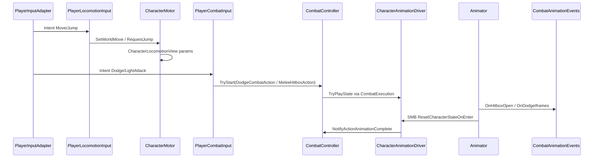

# Character animations — humanoid (root-motion combat & dodge)

**Player is a character.** Locomotion, animator playback, root motion, and clip events are **entity-agnostic** (`AF.Character`).  
`AF.Player` only adapts input, camera, and run-state gating onto the same component stack an AI humanoid uses later.

Integrate: scripted locomotion blend tree, **root-motion dodge**, **root-motion combat**.  
Weapon clips later via **pre-authored `AnimatorOverrideController` assets** — no runtime override creation.

**Builds on:** [player-locomotion-camera.md](player-locomotion-camera.md) (motor/camera — migrate names to Character*), [combat-minimum-v2.md](combat-minimum-v2.md)  
**Supersedes:** [player-animations.md](player-animations.md) (player-centric draft), velocity dodge in locomotion doc.

---

## Design principle

| Layer | Package | Responsibility |
|-------|---------|----------------|
| **Character body** | `AF.Character` | Motor, animation driver, view, root motion, animation set swap |
| **Combat verbs** | `AF.Combat` | `CombatAction` subclasses (`MeleeHitboxAction`, `DodgeCombatAction`) call `IActionAnimator` |
| **Player adapters** | `AF.Player` | `PlayerInputAdapter`, `PlayerLocomotionInput`, `PlayerCombatInput`, camera, control gate |
| **Shared contracts** | `AF.Core` | `IActionAnimator`, `ILocomotionReadout`, `LocomotionMath`, `PlayerIntent` |

Enemy humanoid later = same `Character*` components + `AF.AI` driver calling `CombatController.TryStart` — **no forked animation code**.

---

## How Cacildes does it (reference)

| Piece | Role |
|-------|------|
| `CharacterBaseManager.PlayBusy*WithRootMotion` | `isBusy`, `applyRootMotion`, play state |
| `PlayerManager.ResetStates` | Clears busy — **we reject** the god-object reset cascade |
| `ResetCharacterStatesOnStateEnter` (SMB) | Locomotion hub → reset action state |
| `ThirdPersonController` | Blend params when not busy — becomes `CharacterLocomotionView` |
| `PlayerCombatController` / `PlayerDodgeController` | Play anims — becomes `CombatAction.Begin` + `IActionAnimator` |
| `PlayerAnimationEventListener` | Clip events — becomes `CharacterAnimationEvents` |

**Do not port:** `AnimatorOverrideHandler` runtime `new AnimatorOverrideController(...)`, `WeaponAnimation` override list builders.

---

## Cacildes vs AF

| Cacildes | AF |
|----------|-----|
| `PlayerManager` owns animation | `CharacterAnimationDriver` on **any** humanoid root |
| `PlayerDodgeController` | `DodgeCombatAction` + `IActionAnimator` (player **and** AI) |
| `PlayerCombatController` plays anims | `MeleeHitboxAction.Begin` → `ctx.Animator` |
| `PlayerAnimationEventListener` monolith | `CombatAnimationEvents` on model child (`AF.Combat`) |
| Runtime override creation | Editor-authored override assets + `CharacterAnimationSet` |
| `PlayerMotor` / `PlayerView` | `CharacterMotor` / `CharacterLocomotionView` |

---

## Entity composition (humanoid)

```
CharacterRoot                     ← CharacterController, combat, character systems
├── CharacterMotor                ← scripted CC move; no input/camera refs
├── CharacterAnimationDriver      ← IActionAnimator; busy + root-motion mode
├── CharacterLocomotionView       ← blend params from motor + driver
├── CharacterAnimationSet         ← swaps override controller (Editor assets)
├── CombatController
├── CombatActor / Health / Hurtbox
└── …

CharacterModel (child)
├── Animator
├── CharacterRootMotionApplier    ← OnAnimatorMove → parent CC
└── CombatAnimationEvents         ← AF.Combat — hitbox / action complete

────────── Player prefab adds ──────────
├── PlayerInputAdapter            ← Input System → PlayerIntent
├── PlayerLocomotionInput         ← intent + camera yaw → CharacterMotor
├── PlayerCombatInput             ← intent → CombatController (attack + dodge actions)
├── PlayerCameraRig
└── PlayerControlGate             ← enables adapters + camera (not motor internals)
```

**Rule:** `OnAnimatorMove` lives on the **Animator child**; it moves the **parent** `CharacterController` root.

---

## Animator assets (Editor — humanoid v1)

```
Assets/Data/Character/Animation/
├── Controllers/
│   ├── Humanoid_Base.controller
│   └── Humanoid_Unarmed.overrideController
├── Clips/
│   ├── Locomotion/
│   ├── Combat/
│   └── Dodge/
└── Avatars/
```

### Base controller (shared humanoid contract)

| State / tree | Params |
|--------------|--------|
| Locomotion blend tree | `Speed`, `MotionSpeed` |
| Jump | `Jump` (trigger) |
| In Air | `Grounded`, `FreeFall` |
| **Locomotion Hub** | SMB: `ResetCharacterStateOnEnter` |
| `Action_Roll` / `Action_BackStep` | root motion |
| `Action_LightAttack_01` | root motion |

### Clip slot names (override keys)

| Slot clip name | Used for |
|----------------|----------|
| `af_loco_idle` | Idle |
| `af_loco_walk` | Walk |
| `af_loco_run` | Run |
| `af_action_light_attack_01` | Light attack 1 |
| `af_action_roll` | Dodge roll |
| `af_action_backstep` | Backstep |

Per-weapon: duplicate override asset in Editor — **never** `new AnimatorOverrideController` in code.

---

## Core contracts (`AF.Core`)

### `IActionAnimator.cs` (exists)

```csharp
namespace AF.Core
{
    /// <summary>Timed action playback (attack, dodge, interact). On player and AI humanoids.</summary>
    public interface IActionAnimator
    {
        bool IsBusy { get; }
        bool IsRootMotionActive { get; }

        bool TryPlayState(int stateHash, bool useRootMotion);
        void OnActionComplete();
    }
}
```

### `ILocomotionReadout.cs` (NEW)

Combat actions (dodge backstep vs roll) need move direction **without** reading `AF.Player`.

```csharp
using UnityEngine;

namespace AF.Core
{
    /// <summary>Current locomotion snapshot on a character. Player adapter fills from intent; AI from steering.</summary>
    public interface ILocomotionReadout
    {
        Vector2 MoveInput { get; }
        bool IsGrounded { get; }
    }
}
```

`PlayerLocomotionInput` implements this on the player root. `CharacterMotor` can also implement it (grounded + last move input).

---

## Package layout

```
Assets/_Project/
├── Core/Runtime/
│   ├── IActionAnimator.cs
│   ├── ILocomotionReadout.cs
│   └── LocomotionMath.cs
│
├── Character/
│   ├── AF.Character.asmdef          ← refs AF.Core only
│   └── Runtime/
│       ├── HumanoidAnimationHashes.cs
│       ├── CharacterLocomotionSettings.cs
│       ├── CharacterMotor.cs
│       ├── CharacterLocomotionView.cs
│       ├── CharacterAnimationDriver.cs
│       ├── CharacterRootMotionApplier.cs
│       ├── CharacterAnimationSet.cs
│       └── Animation/
│           └── ResetCharacterStateOnEnter.cs
│
├── Combat/
│   ├── DodgeCombatAction.cs         ← NEW
│   ├── MeleeHitboxAction.cs         ← UPDATE (ctx.Animator)
│   └── CombatExecution.cs           ← UPDATE (+ Animator, Locomotion)
│
└── Player/Runtime/
    ├── PlayerLocomotionInput.cs       ← NEW (replaces motor reading input/camera)
    ├── PlayerCombatInput.cs           ← MOVE from Combat; add dodge action
    ├── PlayerInputAdapter.cs
    ├── PlayerCameraRig.cs
    └── PlayerControlGate.cs
```

### `AF.Character.asmdef`

```json
{
  "name": "AF.Character",
  "rootNamespace": "AF.Character",
  "references": ["AF.Core"],
  "includePlatforms": [],
  "excludePlatforms": [],
  "allowUnsafeCode": false,
  "overrideReferences": false,
  "precompiledReferences": [],
  "autoReferenced": true,
  "defineConstraints": [],
  "versionDefines": [],
  "noEngineReferences": false
}
```

### Asmdef edges

| Assembly | References |
|----------|------------|
| `AF.Core` | — |
| `AF.Character` | `AF.Core` |
| `AF.Combat` | `AF.Core`, `AF.Stats` |
| `AF.Player` | `AF.Core`, `AF.Character`, `AF.Combat`, Input System |

`AF.Combat` must **not** reference `AF.Player`. `CombatExecution` carries `IActionAnimator` + `ILocomotionReadout` wired in Editor or `Awake` on the character root.

---

## Phase plan

| Phase | Deliverable |
|-------|-------------|
| **1** | `AF.Character` + `CharacterMotor` + `CharacterLocomotionView` + base controller |
| **2** | `CharacterAnimationDriver` + `CharacterRootMotionApplier` |
| **3** | `DodgeCombatAction` + `MeleeHitboxAction` + `CharacterAnimationEvents` |
| **4** | `Humanoid_Unarmed.overrideController` + `CharacterAnimationSet` |
| **5** | Per-weapon override assets (content) |

**Delete / stop using:** `PlayerMotor`, `PlayerDodge`, `PlayerView`, `PlayerLocomotionSettings`, `PlayerAnimationHashes` in `AF.Player` — migrate to Character package.

---

# Phase 1 — Character locomotion + presentation

### `HumanoidAnimationHashes.cs`

```csharp
using UnityEngine;

namespace AF.Character
{
    /// <summary>Shared humanoid animator contract — player and AI use the same hashes.</summary>
    public static class HumanoidAnimationHashes
    {
        public static readonly int Speed = Animator.StringToHash("Speed");
        public static readonly int MotionSpeed = Animator.StringToHash("MotionSpeed");
        public static readonly int Grounded = Animator.StringToHash("Grounded");
        public static readonly int Jump = Animator.StringToHash("Jump");
        public static readonly int FreeFall = Animator.StringToHash("FreeFall");

        public static readonly int StateRoll = Animator.StringToHash("Action_Roll");
        public static readonly int StateBackStep = Animator.StringToHash("Action_BackStep");
        public static readonly int StateLightAttack01 = Animator.StringToHash("Action_LightAttack_01");
    }
}
```

### `CharacterLocomotionSettings.cs`

```csharp
using UnityEngine;

namespace AF.Character
{
    [CreateAssetMenu(fileName = "CharacterLocomotionSettings", menuName = "AF/Character/Locomotion Settings")]
    public sealed class CharacterLocomotionSettings : ScriptableObject
    {
        public float moveSpeed = 5f;
        public float rotationSpeed = 12f;
        public float jumpHeight = 1.2f;
        public float gravity = -20f;
        public float jumpTimeout = 0.25f;
        public float groundedStickVelocity = -2f;
    }
}
```

### `CharacterMotor.cs`

No `PlayerInput`, no `Camera`, no `PlayerIntent`. Receives **world-space** move from outside.

```csharp
using AF.Core;
using UnityEngine;

namespace AF.Character
{
    [RequireComponent(typeof(CharacterController))]
    public sealed class CharacterMotor : MonoBehaviour, ILocomotionReadout
    {
        [SerializeField] CharacterLocomotionSettings settings;
        [SerializeField] CharacterAnimationDriver animationDriver;

        CharacterController controller;

        Vector3 worldMoveDirection;
        float moveMagnitude;
        float verticalVelocity;
        float jumpTimeoutDelta;
        bool jumpRequested;
        bool isEnabled = true;

        public Vector2 MoveInput => new Vector2(worldMoveDirection.x, worldMoveDirection.z);
        public bool IsGrounded => controller != null && controller.isGrounded;
        public float HorizontalSpeed => moveMagnitude * (settings != null ? settings.moveSpeed : 0f);
        public float VerticalVelocity => verticalVelocity;

        void Awake()
        {
            controller = GetComponent<CharacterController>();
            if (animationDriver == null)
            {
                animationDriver = GetComponent<CharacterAnimationDriver>();
            }
        }

        void Update()
        {
            if (!isEnabled || settings == null)
            {
                return;
            }

            if (animationDriver != null && animationDriver.IsBusy)
            {
                ApplyGravityOnly();
                return;
            }

            UpdateJumpTimeout();
            HandleJump();
            ApplyGravity();

            Vector3 horizontal = worldMoveDirection * moveMagnitude * settings.moveSpeed;
            if (horizontal.sqrMagnitude > 0.01f)
            {
                Quaternion targetRotation = Quaternion.LookRotation(horizontal);
                transform.rotation = Quaternion.Slerp(
                    transform.rotation,
                    targetRotation,
                    settings.rotationSpeed * Time.deltaTime);
            }

            Vector3 velocity = horizontal;
            velocity.y = verticalVelocity;
            controller.Move(velocity * Time.deltaTime);
        }

        /// <summary>Called by PlayerLocomotionInput or AI steering.</summary>
        public void SetWorldMove(Vector3 direction, float magnitude)
        {
            worldMoveDirection = direction.sqrMagnitude > 0.01f ? direction.normalized : Vector3.zero;
            moveMagnitude = Mathf.Clamp01(magnitude);
        }

        public void RequestJump()
        {
            jumpRequested = true;
        }

        void HandleJump()
        {
            if (!jumpRequested)
            {
                return;
            }

            jumpRequested = false;
            if (!IsGrounded || jumpTimeoutDelta > 0f)
            {
                return;
            }

            verticalVelocity = LocomotionMath.ComputeJumpVelocity(settings.jumpHeight, settings.gravity);
            jumpTimeoutDelta = settings.jumpTimeout;
            GetComponent<CharacterLocomotionView>()?.NotifyJumpTriggered();
        }

        void UpdateJumpTimeout()
        {
            if (jumpTimeoutDelta > 0f)
            {
                jumpTimeoutDelta -= Time.deltaTime;
            }
        }

        void ApplyGravity()
        {
            if (IsGrounded && verticalVelocity < 0f)
            {
                verticalVelocity = settings.groundedStickVelocity;
            }

            verticalVelocity += settings.gravity * Time.deltaTime;
        }

        void ApplyGravityOnly()
        {
            ApplyGravity();
            controller.Move(new Vector3(0f, verticalVelocity, 0f) * Time.deltaTime);
        }

        public void SetMotorEnabled(bool enabled) => isEnabled = enabled;
    }
}
```

### `CharacterLocomotionView.cs`

```csharp
using UnityEngine;

namespace AF.Character
{
    [RequireComponent(typeof(CharacterMotor))]
    public sealed class CharacterLocomotionView : MonoBehaviour
    {
        [SerializeField] Animator animator;
        [SerializeField] CharacterMotor motor;
        [SerializeField] CharacterAnimationDriver driver;
        [SerializeField] float dampTime = 0.1f;

        void Awake()
        {
            if (motor == null) motor = GetComponent<CharacterMotor>();
            if (driver == null) driver = GetComponent<CharacterAnimationDriver>();
            if (animator == null) animator = GetComponentInChildren<Animator>();
        }

        void Update()
        {
            if (animator == null || motor == null)
            {
                return;
            }

            bool canDrive = driver == null || !driver.IsBusy;

            animator.SetBool(HumanoidAnimationHashes.Grounded, motor.IsGrounded);
            animator.SetBool(HumanoidAnimationHashes.FreeFall, !motor.IsGrounded && motor.VerticalVelocity < -0.1f);

            float speed = canDrive ? motor.HorizontalSpeed : 0f;
            animator.SetFloat(HumanoidAnimationHashes.Speed, speed, dampTime, Time.deltaTime);
            animator.SetFloat(HumanoidAnimationHashes.MotionSpeed, 1f);
        }

        public void NotifyJumpTriggered()
        {
            if (animator != null)
            {
                animator.SetTrigger(HumanoidAnimationHashes.Jump);
            }
        }
    }
}
```

### `PlayerLocomotionInput.cs` (player-only adapter)

```csharp
using AF.Core;
using UnityEngine;

namespace AF.Player
{
    /// <summary>Maps player intent + camera yaw into CharacterMotor. AI uses its own steering adapter.</summary>
    [RequireComponent(typeof(CharacterMotor))]
    public sealed class PlayerLocomotionInput : MonoBehaviour, ILocomotionReadout
    {
        [SerializeField] PlayerInputAdapter input;
        [SerializeField] PlayerCameraRig cameraRig;
        [SerializeField] CharacterMotor motor;

        bool isEnabled;

        public Vector2 MoveInput => input != null ? input.Intent.Move : Vector2.zero;
        public bool IsGrounded => motor != null && motor.IsGrounded;

        void Awake()
        {
            if (motor == null) motor = GetComponent<CharacterMotor>();
            if (input == null) input = GetComponent<PlayerInputAdapter>();
        }

        void Update()
        {
            if (!isEnabled || input == null || motor == null)
            {
                return;
            }

            PlayerIntent intent = input.Intent;
            float yaw = cameraRig != null ? cameraRig.YawDegrees : 0f;
            Vector3 worldDir = LocomotionMath.CameraRelativeMove(intent.Move, yaw);
            motor.SetWorldMove(worldDir, intent.Move.magnitude);

            if (intent.Jump)
            {
                motor.RequestJump();
            }
        }

        public void SetLocomotionInputEnabled(bool enabled) => isEnabled = enabled;
    }
}
```

Add `AF.Character` to `AF.Player.asmdef`. `PlayerLocomotionInput` needs `using AF.Character`.

---

# Phase 2 — Root motion

### `CharacterAnimationDriver.cs`

```csharp
using AF.Core;
using UnityEngine;

namespace AF.Character
{
    [RequireComponent(typeof(CharacterMotor))]
    public sealed class CharacterAnimationDriver : MonoBehaviour, IActionAnimator
    {
        [SerializeField] Animator animator;
        [SerializeField] int actionLayer;

        public bool IsBusy { get; private set; }
        public bool IsRootMotionActive { get; private set; }

        void Awake()
        {
            if (animator == null) animator = GetComponentInChildren<Animator>();
        }

        public bool TryPlayState(int stateHash, bool useRootMotion)
        {
            if (animator == null || IsBusy)
            {
                return false;
            }

            IsBusy = true;
            IsRootMotionActive = useRootMotion;
            animator.applyRootMotion = useRootMotion;
            animator.CrossFadeInFixedTime(stateHash, 0.1f, actionLayer);
            return true;
        }

        public void OnActionComplete()
        {
            IsBusy = false;
            IsRootMotionActive = false;
            if (animator != null)
            {
                animator.applyRootMotion = false;
            }
        }
    }
}
```

### `CharacterRootMotionApplier.cs` (on model child)

```csharp
using UnityEngine;

namespace AF.Character
{
    [RequireComponent(typeof(Animator))]
    public sealed class CharacterRootMotionApplier : MonoBehaviour
    {
        [SerializeField] Transform characterRoot;
        [SerializeField] CharacterController characterController;
        [SerializeField] CharacterAnimationDriver driver;

        Animator animator;

        void Awake()
        {
            animator = GetComponent<Animator>();
            if (characterRoot == null) characterRoot = transform.parent;
            if (characterController == null && characterRoot != null)
            {
                characterController = characterRoot.GetComponent<CharacterController>();
            }
            if (driver == null && characterRoot != null)
            {
                driver = characterRoot.GetComponent<CharacterAnimationDriver>();
            }
        }

        void OnAnimatorMove()
        {
            if (animator == null || !animator.applyRootMotion || driver == null || !driver.IsRootMotionActive)
            {
                return;
            }

            if (characterController != null)
            {
                characterController.Move(animator.deltaPosition);
                characterRoot.rotation *= animator.deltaRotation;
            }
            else if (characterRoot != null)
            {
                characterRoot.position += animator.deltaPosition;
                characterRoot.rotation *= animator.deltaRotation;
            }
        }
    }
}
```

**No `PlayerDodge`.** Dodge is a combat verb (Phase 3).

---

# Phase 3 — Combat + dodge via `CombatAction`

### `CombatExecution.cs` (update)

```csharp
using AF.Core;

namespace AF.Combat
{
    public sealed class CombatExecution
    {
        public CombatController Controller { get; }
        public CombatActor Actor { get; }
        public Hitbox Hitbox { get; }
        public IActionAnimator Animator { get; }
        public ILocomotionReadout Locomotion { get; }

        public CombatExecution(
            CombatController controller,
            CombatActor actor,
            Hitbox hitbox,
            IActionAnimator animator,
            ILocomotionReadout locomotion)
        {
            Controller = controller;
            Actor = actor;
            Hitbox = hitbox;
            Animator = animator;
            Locomotion = locomotion;
        }
    }
}
```

Wire on character root in `CombatController.Awake`: resolve `IActionAnimator` + `ILocomotionReadout` via `GetComponent` once.

### `DodgeCombatAction.cs`

```csharp
using AF.Character;
using AF.Core;
using UnityEngine;

namespace AF.Combat
{
    [CreateAssetMenu(fileName = "DodgeCombatAction", menuName = "AF/Combat/Dodge Action")]
    public sealed class DodgeCombatAction : CombatAction
    {
        [Header("Animation")]
        public int rollStateHash = HumanoidAnimationHashes.StateRoll;
        public int backstepStateHash = HumanoidAnimationHashes.StateBackStep;

        [Header("Rules")]
        public float cooldown = 0.5f;

        public override bool CanExecute(CombatExecution ctx)
        {
            if (!base.CanExecute(ctx))
            {
                return false;
            }

            return ctx.Locomotion != null && ctx.Locomotion.IsGrounded;
        }

        public override void Begin(CombatExecution ctx)
        {
            if (ctx.Animator == null || ctx.Locomotion == null)
            {
                return;
            }

            bool backstep = ctx.Locomotion.MoveInput.sqrMagnitude < 0.01f;
            int state = backstep ? backstepStateHash : rollStateHash;

            if (!ctx.Animator.TryPlayState(state, useRootMotion: true))
            {
                ctx.Controller.CancelActiveAction();
                return;
            }
        }

        public override void Tick(CombatExecution ctx, float deltaTime) { }

        public override void End(CombatExecution ctx) { }
    }
}
```

`AF.Combat` needs `AF.Character` reference **only** for default hash constants in `DodgeCombatAction`. Alternative: use plain `int` fields on the SO with no Character import — then Combat stays Character-free. **Prefer:** assign hashes on the `Dodge_Unarmed.asset` in Editor; remove `using AF.Character` from Combat — keep asmdef `AF.Combat` → `AF.Core` only.

Revised `DodgeCombatAction` without Character ref:

```csharp
public int rollStateHash;
public int backstepStateHash;
// Set in asset: HumanoidAnimationHashes values typed on player prefab setup doc
```

### `MeleeHitboxAction.cs` (animation-driven)

```csharp
public int animatorStateHash;

public override void Begin(CombatExecution ctx)
{
    ctx.Hitbox?.ConfigureDamage(damage);

    if (ctx.Animator == null || !ctx.Animator.TryPlayState(animatorStateHash, useRootMotion: true))
    {
        ctx.Controller.CancelActiveAction();
        return;
    }
}
```

Hitbox open/close via clip events only.

### `CombatAnimationEvents.cs` (`AF.Combat`, on model child)

`AF.Character` does **not** reference `AF.Combat`. Hitbox clip events live in Combat.  
**Preferred (no clip events):** [animation-presentation-schedule.md](animation-presentation-schedule.md) — schedule SO + `PresentationScheduler` + receivers (combat + footsteps).

**Legacy clip events:** [combat-minimum-v2.md Part E](combat-minimum-v2.md#part-e--animation-driven-action-completion) — `CombatAnimationEvents` on model child.

### `ResetCharacterStateOnEnter.cs` (SMB)

```csharp
using AF.Core;
using UnityEngine;

namespace AF.Character
{
    public sealed class ResetCharacterStateOnEnter : StateMachineBehaviour
    {
        IActionAnimator actionAnimator;
        IActionPresentationComplete presentationComplete;

        public override void OnStateEnter(Animator animator, AnimatorStateInfo stateInfo, int layerIndex)
        {
            actionAnimator ??= animator.GetComponentInParent<IActionAnimator>();
            presentationComplete ??= animator.GetComponentInParent<IActionPresentationComplete>();

            actionAnimator?.OnActionComplete();
            presentationComplete?.OnActionPresentationComplete();
        }
    }
}
```

See [combat-minimum-v2.md Part E](combat-minimum-v2.md#part-e--animation-driven-action-completion) for `IActionPresentationComplete` and `CombatController.NotifyActionAnimationComplete`.

### `PlayerCombatInput.cs` (player adapter — attack + dodge)

```csharp
using AF.Core;
using UnityEngine;

namespace AF.Player
{
    public sealed class PlayerCombatInput : MonoBehaviour
    {
        [SerializeField] CombatController combat;
        [SerializeField] MeleeHitboxAction lightAttack;
        [SerializeField] DodgeCombatAction dodge;

        IPlayerIntentSource intentSource;

        void Awake()
        {
            intentSource = GetComponent<IPlayerIntentSource>();
        }

        void Update()
        {
            if (intentSource == null || combat == null)
            {
                return;
            }

            PlayerIntent intent = intentSource.Intent;

            if (intent.LightAttack && lightAttack != null)
            {
                combat.TryStart(lightAttack);
            }

            if (intent.Dodge && dodge != null)
            {
                combat.TryStart(dodge);
            }
        }
    }
}
```

Move file from `AF.Combat` to `AF.Player` if it still lives in Combat assembly.

---

# Phase 4 — Animation set swap

### `CharacterAnimationSet.cs`

```csharp
using UnityEngine;

namespace AF.Character
{
    public sealed class CharacterAnimationSet : MonoBehaviour
    {
        [SerializeField] Animator animator;
        [SerializeField] RuntimeAnimatorController defaultOverride;

        void Awake()
        {
            if (animator == null) animator = GetComponentInChildren<Animator>();
        }

        public void ApplyController(RuntimeAnimatorController controller)
        {
            if (animator != null && controller != null)
            {
                animator.runtimeAnimatorController = controller;
            }
        }
    }
}
```

Future: `WeaponDefinition.overrideController` → `CharacterAnimationSet.ApplyController(...)`.

---

## Data flow



---

## Player graybox hierarchy

```
Player (CharacterRoot)
├── CharacterController
├── CharacterMotor
├── CharacterAnimationDriver
├── CharacterLocomotionView
├── CharacterAnimationSet
├── CombatController / CombatActor / Health / …
├── PlayerInputAdapter
├── PlayerLocomotionInput          ← ILocomotionReadout for combat
├── PlayerCombatInput
├── PlayerControlGate
└── Model
    ├── Animator
    ├── CharacterRootMotionApplier
    └── CombatAnimationEvents      ← AF.Combat, on model child
```

`PlayerControlGate` enables **adapters** (`PlayerLocomotionInput`, `PlayerCombatInput`, input, camera) — not `CharacterMotor` internals directly (motor can stay enabled; adapters zero input when menu open).

---

## Play verification

| # | Test |
|---|------|
| 1 | Locomotion blend follows stick (player adapter → motor) |
| 2 | Jump trigger; `Grounded` / `FreeFall` correct |
| 3 | Dodge roll / backstep via `DodgeCombatAction` + root motion |
| 4 | Light attack root motion; hitbox only on clip events |
| 5 | After action, locomotion hub SMB clears busy |
| 6 | Cannot dodge during attack (`CombatController.IsBusy`) |
| 7 | Same `CharacterAnimationDriver` component could be duplicated on enemy prefab (manual test later) |

---

## Full checklist

- [ ] `AF.Character` asmdef + migrate motor/view/settings off `AF.Player`
- [ ] `PlayerLocomotionInput` + `ILocomotionReadout`; remove input/camera from motor
- [ ] Phase 1: base controller + model in scene
- [ ] Phase 2: `CharacterAnimationDriver` + `CharacterRootMotionApplier`
- [ ] Phase 3: `DodgeCombatAction`; delete `PlayerDodge`
- [ ] Phase 3: `CombatAnimationEvents` (`AF.Combat`) + `CombatExecution` wiring
- [ ] `PlayerCombatInput` in `AF.Player` (attack + dodge); remove from Combat asmdef
- [ ] Phase 4: `Humanoid_Unarmed.overrideController` + `CharacterAnimationSet`
- [ ] Grep: no runtime `AnimatorOverrideController` construction
- [ ] Grep: no `PlayerMotor` / `PlayerDodge` / `PlayerView` left in Player package

---

## Locomotion doc follow-up

[player-locomotion-camera.md](player-locomotion-camera.md) still names `PlayerMotor` / `PlayerDodge`. When typing locomotion, use **`CharacterMotor`** + **`PlayerLocomotionInput`** instead. Camera (`PlayerCameraRig`) correctly stays in `AF.Player`.

---

## Later

- `AF.AI` steering adapter → `CharacterMotor.SetWorldMove`
- AI `CombatBrain` → same `DodgeCombatAction` / `MeleeHitboxAction`
- Combo windows via anim events + `CombatAction.next`
- Lock-on strafe overrides (separate override asset slots)
